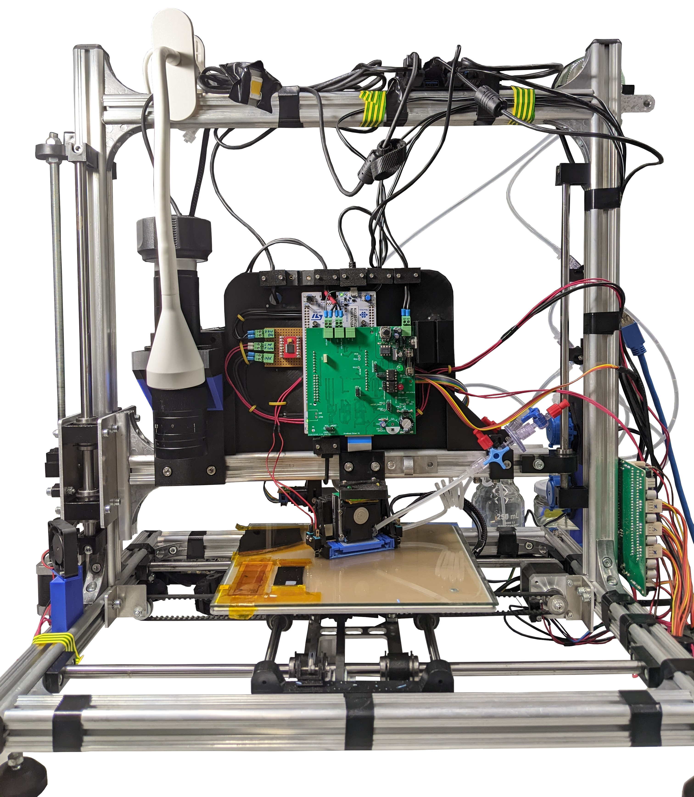
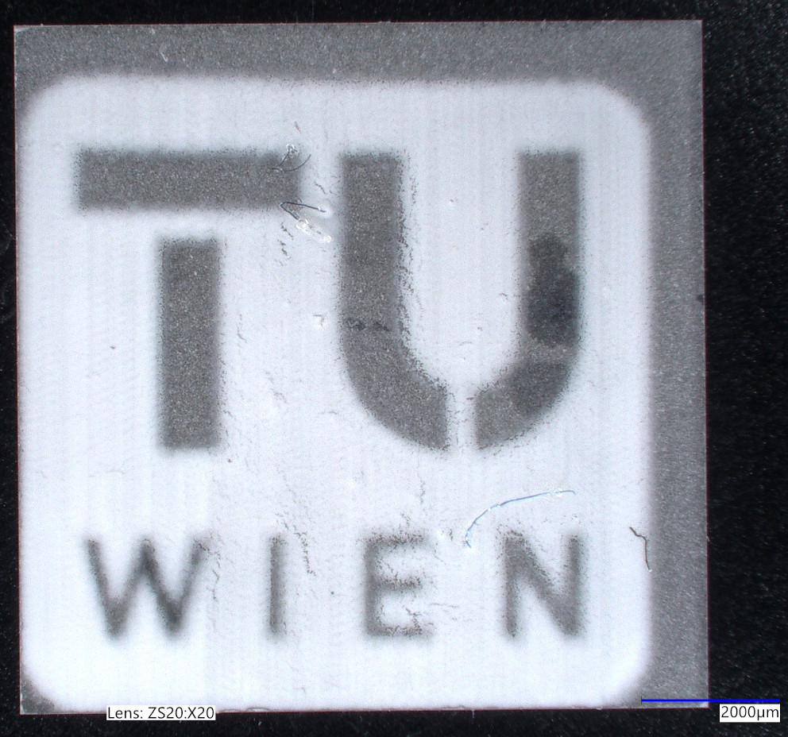

# Inkjet Printer
This repository contains the code, PCB, and CAD of the custom-designed inkjet printer for printing ceramics, which was created as part of the master thesis [Development of an Inkjet Printer for Electrolyte Layers of Oxygen Ion Batteries](https://doi.org/10.34726/hss.2024.116604).

See a preview of the control software: [https://tuwrraphael.github.io/inkjet-printer/](https://tuwrraphael.github.io/inkjet-printer/).

  

    
    
An overview image of the implemented inkjet printer.

  

  

    
    
A microscope image of a printed TU Wien logo on a 10mm x 10mm substrate.

  

Details about the printer, challenges and design decisions, its application and evaluation can be found in the thesis.

Repository structure:
* [inkjet-printer-app](inkjet-printer-app): A web app that controls the printer, is used for planning print jobs, print monitoring & evaluation, calibration and maintenance. Runs in a browser using WebUSB and WebSerial for communicating with the hardware. A deployed version to test an be found [here](https://tuwrraphael.github.io/inkjet-printer/).
* [inkjet-printer-zephyr](inkjet-printer-zephyr): The Zephyr based firmware of the printhead drive electronics.
* [pcbs/Xaar128-Driver](pcbs/Xaar128-Driver): The main PBC design of the printhead drive electronics.
* [cad](cad): Various CAD files of attachments added to the printer.

## Cite this work
The main purpose of publishing this repository is to provide insights into the development of a custom inkjet printer. If you got inspired or found parts of this project useful, please cite the thesis.
~~~
@mastersthesis{HaukRaphael2024DoaI,
  title = {Development of an Inkjet Printer for Electrolyte Layers of Oxygen Ion Batteries},
  author = {Hauk, Raphael},
  year    = 2024,
  school  = {TU Wien},
  address = {Vienna, Austria},
  type    = {{Master's thesis}},
  note     = {Available at: \url{https://doi.org/10.34726/hss.2024.116604}}
}
~~~

## Acknowledgements
This research was funded in part by the Austrian Science Fund (FWF) [10.55776/COE5](https://doi.org/10.55776/COE5).

## Licensing
The firmware builds on Zephyr Project, which is licensed under the Apache License 2.0.
Tools and libraries used in the control software are listed in the app [here](https://tuwrraphael.github.io/inkjet-printer/info).